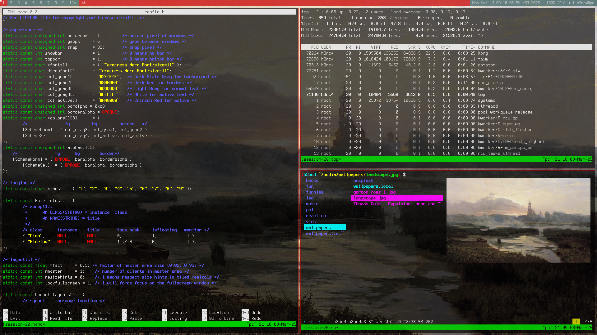

# Dreamweaver

**Dreamweaver** is a Debian GNU/Linux–based distribution focused on minimalism and free software.



## Download

### ISO

Download the latest release ISO image:

- [Download ISO](https://github.com/h3nc4/Dreamweaver/releases/latest/download/debian-dreamweaver-12.9.0.iso)

To verify the integrity of the downloaded image, run the following:

```console
$ wget https://github.com/h3nc4/Dreamweaver/releases/latest/download/debian-dreamweaver-12.9.0.iso
$ wget https://github.com/h3nc4/Dreamweaver/releases/latest/download/debian-dreamweaver-12.9.0.iso.asc
$ wget -qO- https://h3nc4.com/dreamweaver.asc | gpg --import
$ gpg --verify debian-dreamweaver-12.9.0.iso.asc debian-dreamweaver-12.9.0.iso
```

If you see an output similar to the following, the image is verified:

```
gpg: Signature made Sun Feb 16 18:40:30 2025 UTC
gpg:                using RSA key 3BC15CA502A834A6927527DA6B8614EABCBC4AA4
gpg: Good signature from "Dreamweaver <me@h3nc4.com>" [unknown]
```

### Script

Dreamweaver can also be installed on a already running Debian/Devuan machine.

```console
$ wget -qO- https://github.com/h3nc4/Dreamweaver/releases/latest/download/dreamweaver.tgz | tar xf -
$ Dreamweaver/install
```

## Usage

Press super + q to open a terminal and type:

```console
$ man dwm
```

## Flags

The installation script accepts the following optional flags:

- **`-o`**: Include optional packages in the installation.
- **`-d`**: Install development packages.
- **`-g`**: Install gaming-related packages and permit proprietary software.
- **`-v`**: Set up virtualization tools (e.g., QEMU, KVM).
- **`-m <mirror>`**: Specify a custom Debian or Devuan mirror URL. If omitted, the default is:
  - `http://deb.debian.org/debian/` or
  - `http://deb.devuan.org/merged/`

## License

Dreamweaver is free software. You can redistribute and/or modify it under the terms of the GNU General Public License as published by the Free Software Foundation, either version 3 of the License or (at your option) any later version.

Dreamweaver is distributed in the hope that it will be useful, but **WITHOUT ANY WARRANTY**; without even the implied warranty of MERCHANTABILITY or FITNESS FOR A PARTICULAR PURPOSE. See the GNU General Public License for more details.

For further information, please see the [LICENSE](LICENSE) file.
