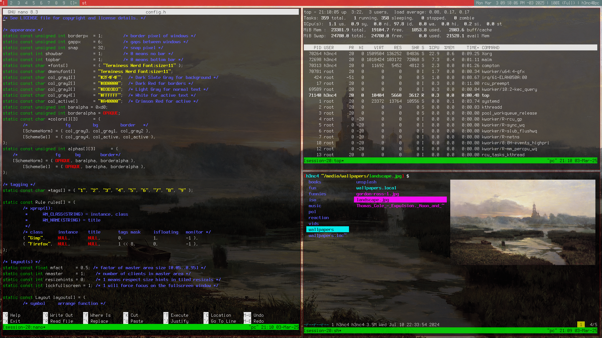

# Dreamweaver

**Dreamweaver** is a Debian and Devuan based distribution focused on minimalism and free software.



## Download

### ISO

Installer images are built from the current Debian and Devuan netinst releases. Both boot on BIOS and UEFI machines, and both keep the upstream signed Secure Boot chain.

- [Debian based image](https://github.com/h3nc4/Dreamweaver/releases/latest/download/dreamweaver-debian-13.6.0-amd64.iso)
- [Devuan based image](https://github.com/h3nc4/Dreamweaver/releases/latest/download/dreamweaver-devuan-6.1.1-amd64.iso)

To verify the integrity of a downloaded image, run the following:

```console
$ iso=dreamweaver-debian-13.6.0-amd64.iso
$ wget "https://github.com/h3nc4/Dreamweaver/releases/latest/download/${iso}"
$ wget "https://github.com/h3nc4/Dreamweaver/releases/latest/download/${iso}.asc"
$ wget -qO- https://h3nc4.com/dreamweaver.asc | gpg --import
$ gpg --verify "${iso}.asc" "${iso}"
```

If you see an output similar to the following, the image is verified:

```
gpg: Signature made Sun Feb 16 18:40:30 2025 UTC
gpg:                using RSA key 3BC15CA502A834A6927527DA6B8614EABCBC4AA4
gpg: Good signature from "Dreamweaver <me@h3nc4.com>" [unknown]
```

### Script

Dreamweaver can also be installed on a already running Debian/Devuan machine.

```console
$ wget -qO- https://github.com/h3nc4/Dreamweaver/releases/latest/download/dreamweaver.tar.gz | tar xzf -
$ Dreamweaver/install
```

## Usage

### dwm on Xorg

Press `super + right shift` to open a menu and search any application.

For a full keybind list, press `super + q` to open a terminal and type:

```console
$ man dwm
```

### dwl on Wayland

To autostart wayland sessions with dwl, create `.wayland` under your profile's `.config` folder

```console
$ touch ~/.config/.wayland
```

## Flags

The installer asks which profile to install. An image built from this repository shows two questions during the installation, one for the graphical session and one for the optional software sets, in whichever installer you booted — text or graphical.

Choosing nothing installs the default: dwm on Xorg, plus the core packages.

### Script flags

Installing on an already running system, the same choices are flags:

- **`-o`**: include extra software.
- **`-d`**: install development software.
- **`-g`**: install gaming software and permit proprietary packages.
- **`-v`**: set up virtualization tools (QEMU, KVM, libvirt).
- **`-h`**: headless, with no graphical session. Overrides `-x` and `-w`.
- **`-x`**: install the Xorg session. The default when neither `-w` nor `-h` is given.
- **`-w`**: install the Wayland session.
- **`-m <mirror>`**: use a custom Debian or Devuan mirror. If omitted, the default is:
  - `http://deb.debian.org/debian/` or
  - `http://deb.devuan.org/merged/`

The installation is a set of numbered steps under `install.d/`, and any of them can be run on its own. Running `./install` again is safe: each step is written so that a second run changes nothing a first run already did.

```console
$ ./install --list                  # the steps, in order
$ ./install --dry-run -d            # what -d would run, without running it
$ ./install --only 070-packages     # just the packages
$ ./install --from 120-grub         # resume from a step
```

The package set lives in `packages/`, one file per category, with a per-distribution file alongside it where the two bases differ.

## Building

The dev container holds the toolchain, so Docker is the only thing the host needs.

```console
$ ./scripts/build-dev-image.sh      # once
$ ./scripts/build-iso.sh            # both images
$ ./scripts/build-iso.sh -d devuan  # just one
```

The images are written to the repository root. Open the repository in a dev container instead to get `xorriso`, QEMU, OVMF and the linters, then see [AGENTS.md](AGENTS.md) for how the repack works and how it is tested.

## License

Dreamweaver is free software. You can redistribute and/or modify it under the terms of the GNU General Public License as published by the Free Software Foundation, either version 3 of the License or (at your option) any later version.

Dreamweaver is distributed in the hope that it will be useful, but **WITHOUT ANY WARRANTY**; without even the implied warranty of MERCHANTABILITY or FITNESS FOR A PARTICULAR PURPOSE. See the GNU General Public License for more details.

For further information, please see the [LICENSE](LICENSE) file.
